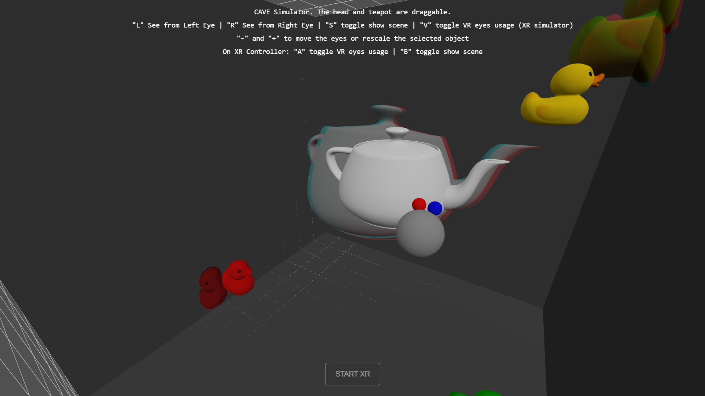
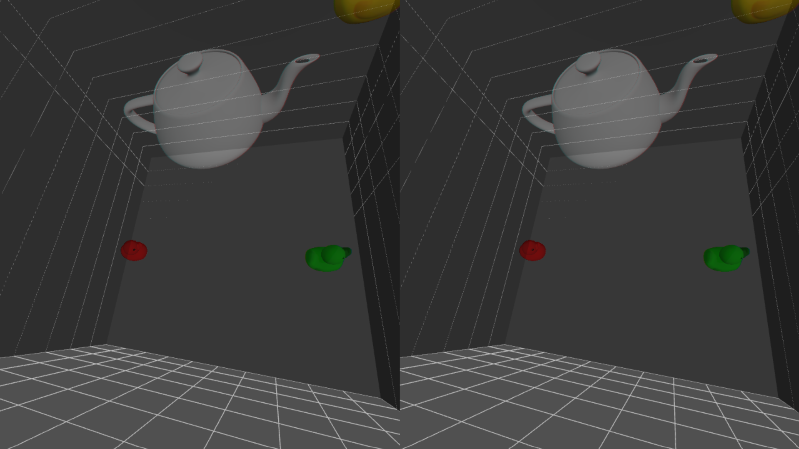

# Stereo Lab Project

This project is a simulator of a CAVE (a room with screen on walls to give the impression to be immersed into a 3D space).

Cave simulator in orbit mode

Cave simulator in XR mode

# What has been done

### CAVE viewing and projection transforms 

- The program computes the two matrixes. Values can be checked using the keybinds "T" and "Y".

### Cave simulator

- We added the right and bottom walls of the cave.
- We added 3 more objects to the scene: 3 very cute debugging rubber ducks
- The user can rescale objects by selecting them (left click), then by using the keybinds "+" and "-".
- The user can change the IOD of the eyes with keybinds "+" and "-" with no selected object. Note that this behavior does not work well when combined with drag control of the eyes.

### XR support

- We hosted the website to the url [astri2.github.io](https://astri2.github.io)
- We added XRSupport to the program.
- Despite trying for a very long time, we did not manage to make this XR support work on actual Meta Quest 3, but it does work on desktop web extenstion such as "Immersive Web Emulator".
- By default the eyes used to project the models to the walls are the eyes of the headset. However you can switch this behavior to use the virtual eyes instead (see Keybinds).

# Keybinds

Please note that we choose the keys to work on a QUERTY keyboard.

- Move orbit camera to left eye: L
- Move orbit camera to right eye: R
- Toggle rendering models: S, or B on XR controller
- Toggle using headset eyes or virtual eyes: V, or A on XR controller
- Rescale objects: select object & +/-
- Change eyes IOD: +/-

# Demo

Here is a link to the demo video: https://youtu.be/Gpt2-YWHMyc

- The extension has mono & stereo mode.  
 In mono mode you only have one camera (a mobile phone device for example) so the left and right projections are perfectly overlapped.  
 In stereo mode you can see that the left eye can see a little bit of blue, while the right eye can see a little bit of red.
